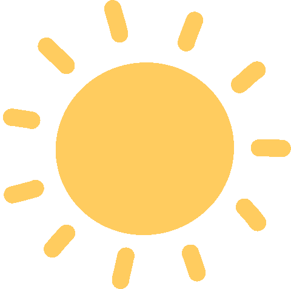

<!DOCTYPE html>
<html lang="en">
  <head>
    <meta charset="UTF-8">
    <meta name="viewport" content="width=device-width, initial-scale=1.0">
    <meta http-equiv="X-UA-Compatible" content="ie=edge">
    <title>J&L 10.16.22</title>

    <!-- Favicon -->
    <link rel="icon" type="image/x-icon" href="images/wedding-birds.ico">
    
    <!-- Google Fonts: Martel, Nunito, & Raleway -->
    <link rel="preconnect" href="https://fonts.googleapis.com">
    <link rel="preconnect" href="https://fonts.gstatic.com" crossorigin>
    <link href="https://fonts.googleapis.com/css2?family=Martel:wght@300;400;700;800&family=Nunito:wght@200;300;400&family=Raleway:ital,wght@0,100;0,200;0,300;0,400;0,700;1,100&display=swap" rel="stylesheet">
    
    <!-- Stylesheet -->
    <link rel="stylesheet" href="style.css">
  </head>
  <body>
    

      <!-- Animated Gif Options -->
      <!--  -->
      
      

        <a class="site-container" href="theknot.com/delucia-xue" target="_blank">
          
          
See our wedding website

        </a>
      

      <h1 class="names">
        Lauren & James
      </h1>
      

        
are getting married

        
on

        

          <h1>October 16, 2022</h1>
        

        
@

        <h3 class="abbey">The Abbey Inn & Spa, Peekskill, NY</h3>
      

    

	
  </body>
</html>